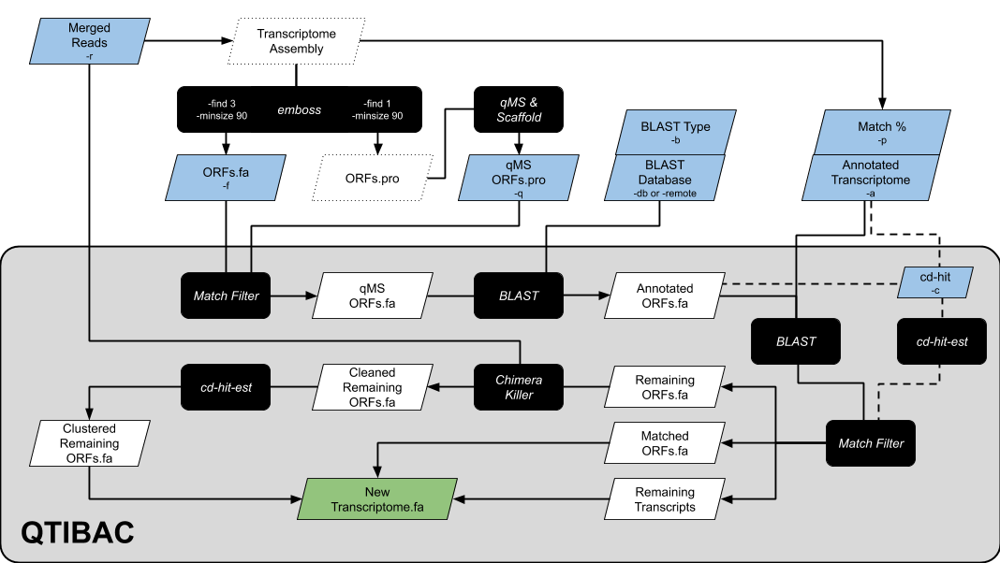

# QTIBAC
**QMS-based Transcript Identification, Blast, Annotation, and Confirmation**

**QTIBAC** is a wrapper script which uses `blast`, `cd-hit`, and [`ChimeraKiller`](https://github.com/masonaj157/ChimeraKiller) to cluster proteomically (quantitative mass spectrometry/qMS) identified ORFs to your transcriptome, blast them to a provided database (or to the NR database on Genbank), and remove chimeric ORFs.

**QTIBAC** provides a new transcriptome with (1) proteomically confirmed transcripts in your transcriptome designated with \*\*\* and (2) non-matched proteomically identifed ORFs appended as 'Putative' novel transcripts.



## Assumptions

1. You have used `emboss` to run `getorf -find 1 -minsize 90 -sequence {}_assembly.fasta -outseq {}_ORFs.pro`
2. You have used `emboss` to run `getorf -find 3 -minsize 90 -sequence {}_assembly.fasta -outseq {}_ORFs.fasta`
3. You have used `{}_ORFs.pro` as your input for qMS identification and quantification.

## Installation

```
conda create -n qtibac_env python=3.6 biopython blast cd-hit bwa samtools bedtools picard pandas matplotlib scipy pysam gatk4 pathos
git clone https://github.com/reptilerhett/QTIBAC.git
git clone https://github.com/masonaj157/ChimeraKiller.git
echo 'export PATH=$PATH:/path/to/QTIBAC:/path/to/ChimeraKiller' >> ~/.bash_profile
```

## Required Arguments

1. `-f {fasta}`: nucleotide ORFs made using `emboss` (see **Assumptions** section; (*e.g.*, `-f {}_ORFs.fasta`)
2. `-q {fasta}`: qMS matched protein ORFs, exported from `Scaffold4` or a similar program (*e.g.*, `-q {}_Scaffold.pro`)
3. `-a {fasta}`: annotated transcriptome fasta (*e.g.*, `-a {}_transcriptome_v1.fasta`)
4. `-r {fastq}`: PEAR merged reads fastq (*e.g.*, `-r {}_pear.fastq`)
5. **Choose option below**
    * `-db {path}` & `-b {blastn/blastx}`: User specified blast database (with `makeblastdb` previously run) and the type of `blast` search (*e.g.*, `-db /path/to/swissprot -b blastx`)
    * `-remote`: blast against the GenBank nr database instead (**Warning**: Much slower)

## Optional Arguments

* `-o {string}`: name for output files
* `-c`: use `cd-hit` instead of `blast` when clustering to your transcriptome
* `-p {integer}`: `blast` or `cd-hit` match percentage when comparing ORFs to transcriptome (default = 99%)
* `-t {integer}`: number of processing threads (default = 8)

## Full Argument List
```
  -h, --help            show this help message and exit
  -f FASTA, --fasta FASTA
                        REQUIRED: Nucleotide ORFs fasta made from assembly and matching the protein ORFs used for QMS identification (i.e. emboss::getorf -find 3)
  -q QMS, --qms QMS     
                        REQUIRED: qMS protein fasta (exported from Scaffold4)
  -a ANNOTATED, --annotated ANNOTATED
                        REQUIRED: Annotated transcriptome fasta
  -r READS, --reads READS
                        REQUIRED: PEAR merged reads
  -db BLAST_DATABASE, --blast_database BLAST_DATABASE
                        Path to blast database for annotation (e.g. SWISSprot). Assumes makeblastdb has already been run.
  -b BLAST_TYPE, --blast_type BLAST_TYPE
                        Type of blast to run (e.g. blastn or blastx) against blast database for annotation. Default assumes blastx
  -remote               Use remote blast against nucleotide database instead of a local blast database. WARNING: This will take much much much much much longer!
  -c, --cdhit           Use cd-hit-est instead of blastn to compare to your annotated transcriptome
  -o OUTPUT, --output OUTPUT
                        Conserved part of name for output files
  -p [MATCHPERCENT], --matchpercent [MATCHPERCENT]
                        Integer percent identity for blastn or cd-hit-est. Default is 99
  -t NUM_THREADS, --num_threads NUM_THREADS
                        Number of threads for blast. Default is 8
  -bp BLAST_PATH, --blast_path BLAST_PATH
                        Directory with blast command. Default assumes it is in your path (e.g. /PATH/TO/BIN/WITH/BLAST/)
  -mbdb MAKEBLASTDB, --makeblastdb MAKEBLASTDB
                        Directory with makeblastdb command. Default assumes it is in your path (e.g. /PATH/TO/BIN/WITH/MAKEBLASTDB/)
  -cdp CDHIT_PATH, --cdhit_path CDHIT_PATH
                        Directory with cd-hit-est-2d command. Default assumes it is in your path (e.g. /PATH/TO/BIN/WITH/CDHIT/)
  --version             show program's version number and exit
  ```

## Output

1. Fasta of nucleotide ORFs matching QMS proteins `{}_QMS_DB.fasta`
2. Fasta of nucleotide ORFs with first BLAST hit in description `{}_QMS_hits.fasta`
3. An xml of top 10 BLAST hits `{}_blast.xml`
4. Fasta of QMS transcripts which matched to the annotated transcriptome
5. Fasta of QMS transcripts which remain after failing to match the annotated transcriptome
6. Fasta of QMS transcripts which remain after removing chimeric sequences
7. Fasta of QMS transcripts which remain after clustering clean sequences
8. New annotated transcriptome with \*\*\* indicating which transcripts are proteomically confirmed and remaining orfs appended

## Examples
Blasting to local database and comparing to annotated transcriptome using cd-hit (note the -db -b -c flags)
 ```
QTIBAC.py -f Cline-CLP2629_ORFs.fasta -q Cline-CLP2629_Scaffold.pro -a Cline-CLP2629_transcriptome_v3.fasta -r Cline-CLP2629_M.assembled.fastq.gz -db /PATH/TO/SWISSprot -b blastx -c -o Cline-CLP2629 -p 99 -t 8
```

Blasting to remote database and comparing to annotated transcriptome using blast (note the -remote flag and lack of -c flag)
```
QTIBAC.py -f Cline-CLP2629_combined_ORFs.fasta -q Cline-CLP2629_QMS_DB.pro -a Cline-CLP2629_transcriptome_v3.fasta -r Cline-CLP2629_M.assembled.fastq.gz -remote -o Cline-CLP2629 -p 99 -t 8
 ```
